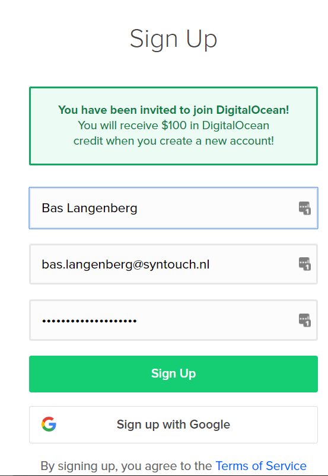
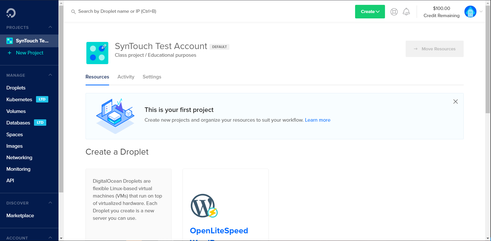
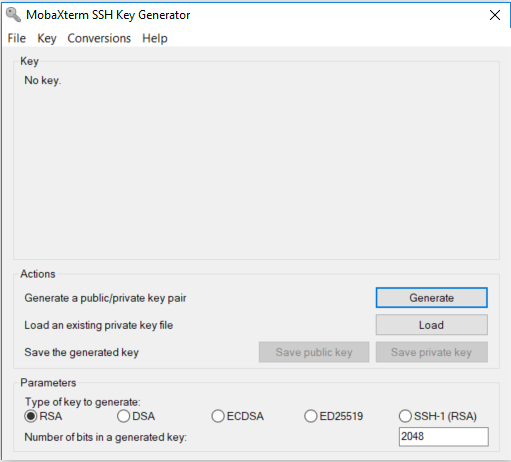

# Setup your digital ocean account

In order to be able to follow the workshop, you need to create a Digital Ocean account. This is free of charge, as you can get a referral code which gives you enough credit for the workshop. If you want too, you can close your account after the workshop to prevent further charges.

For this you need to have a creditcard. Also, make sure to [install MobaXTerm](https://mobaxterm.mobatek.net/). You can use your own SSH client, but this guide assumes MobaXTerm.

## Create account

[Use this link to sign up.](https://m.do.co/c/6ea9fd9553be)

As you see, 100 dollars of credit is added to your account. This will be more than enough for the workshop. It will expire in 2 months, so take a note of this if you want to keep using your account.

After validating your account by using the e-mail link and adding your payment information, you are brought to the dashboard of Digital Ocean. Note the 100 dollar credit in the top right of your dashboard.

Click **Account -> Security** and click *Enable Two-Factor Authentication* to secure your account a bit better.

Click **Account -> Billing** and set a billing alert for one dollar to make sure you get notified before the costs of your account get high and you need to pay much for something you did not intend too.

## Create and upload a public key

#### Generate key

Start MobaXTerm. Click **Tools -> MobaKeyGen**

Defaults are fine. Click generate. Move your mouse to generate some entropy. Add a passphrase to your private key to make it more secure if you want too, save both your private and your public key to a file. **Keep the generator open for a moment.**

#### Upload public key to Digital Ocean

In the Digital Ocean dashboard, upload the *public key* to your account so you can use it later. Easiest way is to copy the content of the public key box in the generator.

**Account -> Security -> Add SSH Key**

#### Export private key in OpenSSH format

Back in the Key Generator, Click **Conversions -> Export OpenSSH key** Save the file without an extention. We will use this on the Linux systems later in the workshop

## Generate API tokens

We will use these later. Guard these with your life. ;-) They enable access to your account in the same way as the console does, with all administrator access you get with it.

Click **Manage -> API** in the dashboard. Click generate new token. Give it a name. Give it read and write. You have one opportunity to copy it. Digital Ocean will not show it to you a second time. Save it somewhere safe, your password manager is a good spot.