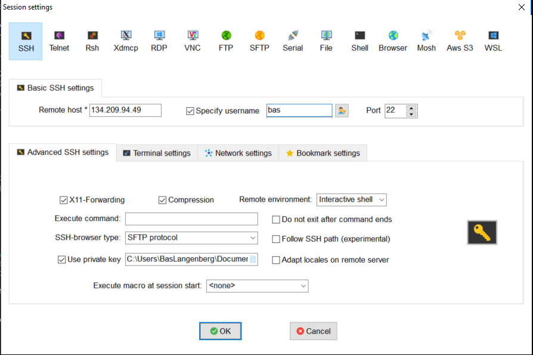

# Chapter 1: Provision your development node

## Initial provision with Cloud-Init

 - [More information about cloud-init](https://www.digitalocean.com/community/tutorials/an-introduction-to-cloud-config-scripting)

It's the chicken and the egg all over again. All of the tools used in this workshop are Linux based, but not everybody has access to a Linux machine. It would be very strange to setup a Linux machine manually on this event! So we will automate it as much as possible. 

For this excercise we will use cloud-init. This tool is available at most if not all cloud providers. While provisioning your node using the console, you paste in a YAML file like the template below, instructing cloud-init, which runs on the first boot, to configure your server for you.

```
#cloud-config
users:
  - name: your-name-here
    groups: sudo
    shell: /bin/bash
    sudo: ['ALL=(ALL) NOPASSWD:ALL']
    ssh-authorized-keys:
      - ssh-rsa YOUR-KEY your-name@syntouch.nl
packages:
 - tmux
 - vim
 - ansible
 - git
package_upgrade: true
power_state:
  timeout: 120
  delay: "+5"
  message: Reboot after setup
  mode: reboot
```

Now, let's explain this a bit.

- The #cloud-config line is manditory. If it's not there, cloud-init will do nothing;
- package_upgrade will update the server with the latest patches;
- power_state will make your server reboot after the patches. You probably got a new glibc or a kernel, which will force you to reboot;


Full sample: (Used by your workshop provider guy)

```
#cloud-config
users:
  - name: bas
    groups: sudo
    shell: /bin/bash
    sudo: ['ALL=(ALL) NOPASSWD:ALL']
    ssh-authorized-keys:
      - ssh-rsa AAAAB3NzaC1yc2EAAAABJQAAAQEA0TTr+v6A8CY4fqhrrxUXTk1wR7IXS9VutmaYsk7zRySeasH8HyWoMRcFM5596Mv1sQkWwog9wR9c89hr56yQt0L8rKkU0i510cne+rUtj19nET8OQl7lxe2J4diL4YaDvTica3yXojeyy3k+k7HyEe8nF2d2NXXSAeR6Si2ReWohP0c/+lvouuFNFbEFGDfRqNpfncwtHWX+L559WMsIpUVl7sfUF7Dx7meOknqcqWDB7O4H5QWRLkV9UIoHXgOvuNUYT+GEhMUStaPQ8MmLNJYsi4R1E3JPNVrSTvLwoDJlfYG8bOmHE50evc+acu+KEogMuixxgwQbTkhid+eEWQ== SynTouch-Workshop
package_upgrade: true
packages:
 - tmux
 - vim
 - ansible
 - git
 - unzip
runcmd:
  - [ snap, install, doctl, --classic]
  - [ curl, -o, /usr/bin/terraform, -LO, http://utils.homecooked.nl/terraform ]
  - [ chmod, ugo+x, /usr/bin/terraform ]
power_state:
  timeout: 120
  delay: "now"
  message: Reboot after setup
  mode: reboot
```

So let's provision a development server.

In the Digital Ocean dashboard, click **Create -> Droplet**. Droplets are what Digital Ocean is calling a VM.

- Under distributions, click Ubuntu. Drop down and click 18.04 x64; 
- Keep the plan on standard. Click the arrow to the left, select a 5 dollar plan. For some reason the standard is to show you the more expensive droplets only now. ;-)
- Keep backups disabled. Do not add block storage;
- Datacenter should be Amsterdam 3;
- Click User data, add the cloud-init configuration you created earlier;
- Make sure the ssh key you added is ticked;
- Create 1 Droplet, Give it a hostname indicating it is your development server. I called mine devel;

after a couple of minutes you should be able to login with your username and own private key. Add a new session to MobaXTerm.



Make sure you specify your username as set in the cloud-init config. Click Advanced SSH settings. Add your exported ssh key in the Use private key section.

Figure out what happened by checking /var/log/cloud-init-output.log. It details what cloud-init did to the server after the initial provision form the Digital Ocean template.

Check if all your tools are there. (Terraform and Ansible)

```
bas@devel:~$ terraform --version
Terraform v0.11.11

Your version of Terraform is out of date! The latest version
is 0.11.13. You can update by downloading from www.terraform.io/downloads.html
bas@devel:~$ ansible --version
ansible 2.5.1
  config file = /etc/ansible/ansible.cfg
  configured module search path = [u'/home/bas/.ansible/plugins/modules', u'/usr/share/ansible/plugins/modules']
  ansible python module location = /usr/lib/python2.7/dist-packages/ansible
  executable location = /usr/bin/ansible
  python version = 2.7.15rc1 (default, Nov 12 2018, 14:31:15) [GCC 7.3.0]
```

## Initial server setup

- [Digital Oceans initial server setup guide](https://www.digitalocean.com/community/tutorials/initial-server-setup-with-ubuntu-18-04)

We almost comply with the initial server setup recommendation. The only thing we need to fix is to disable login as root. Instead of doing this the easy way by editing one line in a file we will of course go for the more complicated way with Ansible. ;-)

Create a file called playbook.yml with your favorite editor. This can also be done locally and later uploaded using the file explorer in MobaXTerm.

```
---
- hosts: localhost
  connection: local

  tasks:
    - name: Dont permit root to ssh
      lineinfile: dest=/etc/ssh/sshd_config
                  regexp="^PermitRootLogin"
                  line="PermitRootLogin no"
                  state=present
      notify: Restart ssh

  handlers:
    - name: Restart ssh
      service: name=sshd state=restarted
````

There are three parts in this file

- hosts: On which host do I need to run this?
- tasks: What are the steps I need to take?
- handlers: We will not do anything, unless when called from a task;

Run this playbook

```
bas@devel:~$ sudo ansible-playbook  playbook.yml
 [WARNING]: provided hosts list is empty, only localhost is available. Note that the implicit localhost does not match 'all'


PLAY [localhost] **********************************************************************************************************************************************************************************************

TASK [Gathering Facts] ****************************************************************************************************************************************************************************************
ok: [localhost]

TASK [Dont permit root to ssh] ********************************************************************************************************************************************************************************
changed: [localhost]

RUNNING HANDLER [Restart ssh] *********************************************************************************************************************************************************************************
changed: [localhost]

PLAY RECAP ****************************************************************************************************************************************************************************************************
localhost                  : ok=3    changed=2    unreachable=0    failed=0
```

If you now look in /etc/ssh/sshd_config, you will notice PermitRootLogin set to no. Run the playbook again.

```
bas@devel:~$ sudo ansible-playbook  playbook.yml
 [WARNING]: provided hosts list is empty, only localhost is available. Note that the implicit localhost does not match 'all'


PLAY [localhost] **********************************************************************************************************************************************************************************************

TASK [Gathering Facts] ****************************************************************************************************************************************************************************************
ok: [localhost]

TASK [Dont permit root to ssh] ********************************************************************************************************************************************************************************
ok: [localhost]

PLAY RECAP ****************************************************************************************************************************************************************************************************
localhost                  : ok=2    changed=0    unreachable=0    failed=0
```

The playbook run is shorter. It did not update the file because the settings were already as described in the file. It is easy to use Ansible like this to validate the configuration of a server. Because the setting was correct, there was no need for a restart, so the handler was not called!

In the next excercise we will investigate a slightly more complicated situation.

## Secret management

Remember the API key you created during your initial setup? You are going to need it now.

Create a file called .secrets in your home directory.

```
vim ~/.secrets
```

Put the following lines in it.

```
DO_ACCESS_TOKEN=IWONTTELLYOU
DO_SSH_FINGERPRINT="I ALSO WILL NOT TELL YOU"

export DO_ACCESS_TOKEN
export DO_SSH_FINGERPRINT
```

Fill out the Access token your created earlier. Leave the SSH fingerprint for the moment. 

Now source the file.

```
. ~/.secrets
```

If you run ```export```now, you will see the variables put in your shell environment.

```
bas@devel:~$ vim ~/.secrets
bas@devel:~$ . ~/.secrets
bas@devel:~$ export
<KNIP>
declare -x DO_ACCESS_TOKEN="IWONTTELLYOU"
declare -x DO_SSH_FINGERPRINT="I ALSO WILL NOT TELL YOU"
declare -x HOME="/home/bas"
declare -x LANG="C.UTF-8"
declare -x LESSCLOSE="/usr/bin/lesspipe %s %s"
declare -x LESSOPEN="| /usr/bin/lesspipe %s"
declare -x LOGNAME="bas"
<KNIP>
```

Now we will figure out what to do with the ssh-key. First, let's generate a new one as they are cheap and easier to manage this way.

```
bas@devel:~$ ssh-keygen -t rsa
Generating public/private rsa key pair.
Enter file in which to save the key (/home/bas/.ssh/id_rsa):
Enter passphrase (empty for no passphrase):
Enter same passphrase again:
Your identification has been saved in /home/bas/.ssh/id_rsa.
Your public key has been saved in /home/bas/.ssh/id_rsa.pub.
The key fingerprint is:
SHA256:m1mFtahhK14vJJfmTZ1Di6KTwwYhqLqNCV7g7IWb2ME bas@devel
The key's randomart image is:
+---[RSA 2048]----+
|            .    |
| .         + .   |
|. . .   o o +    |
|.  . . . = = o   |
|..  . o S + =    |
|+.o  + @ X   .   |
|o+Eo  O * o      |
|=*=. . o .       |
|==o              |
+----[SHA256]-----+
```

Accept the default values. Now we will write a Terraform manifest to upload the key to Digital Ocean.

```
bas@devel:~/setup-node$ mkdir setup-node && cd setup-node
bas@devel:~/setup-node$ cat > key.tf << EOF
variable "do_token" {}

# Configure the DigitalOcean Provider
provider "digitalocean" {
  token = "${var.do_token}"
}

# Create SSH-Key
resource "digitalocean_ssh_key" "default" {
  name       = "Workshop Key"
  public_key = "${file("/home/bas/.ssh/id_rsa.pub")}"
}
EOF

bas@devel:~/setup-node$ terraform init
bas@devel:~/setup-node$ terraform apply -var "do_token=${DO_ACCESS_TOKEN}"
```

check terraform.tfstate file that is created, copy the fingerprint ID in the DO_SSH_FINGERPRINT variable and re-source the file.

```
bas@devel:~$ . ~/.secrets
bas@devel:~$ export
declare -x DISPLAY="localhost:10.0"
declare -x DO_ACCESS_TOKEN=<KNIP>
declare -x DO_SSH_FINGERPRINT=<KNIP>
declare -x HOME="/home/bas"
declare -x LANG="C.UTF-8"
declare -x LESSCLOSE="/usr/bin/lesspipe %s %s"
```

All is now setup for the remainder of the workshop.

## Disclaimer

All the secret stuff was setup manually. That's not the intend of this workshop as we want to automate as much as possible. Since access keys and ssh keys are a problem for the security of our account, we put it in manually here. If you want to automate this more, I suggest you look into [vault](https://www.vaultproject.io/)